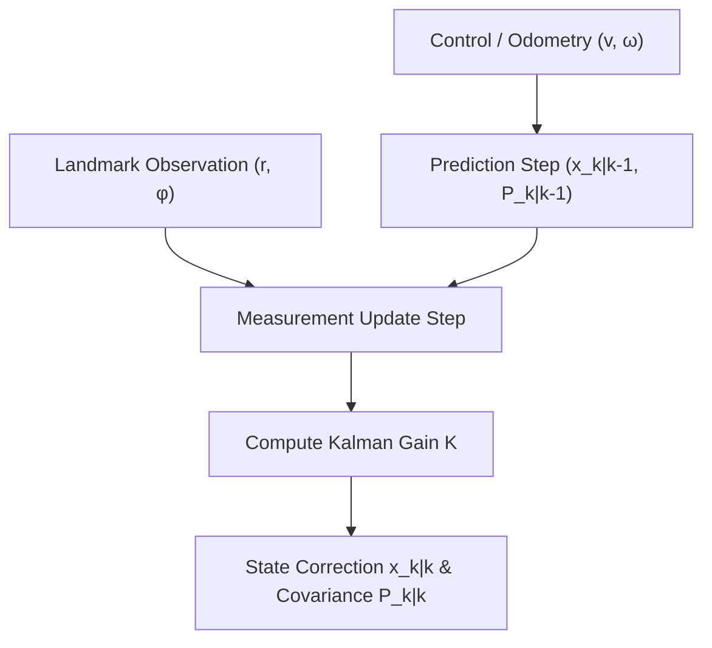

# Extended Kalman Filter (EKF) Localization Skill

Nonlinear Extended Kalman Filter for autonomous ground robot state estimation, dead reckoning odometry fusion, and range-bearing landmark localization.

## Features
- **100% Python Standard Library**: Pure matrix algebra and trigonometric projections.
- **Unicycle Kinematics**: First-order Taylor linearization of differential drive models.
- **Multi-Sensor Fusion**: Combines wheel speed and range-bearing beacon updates.
